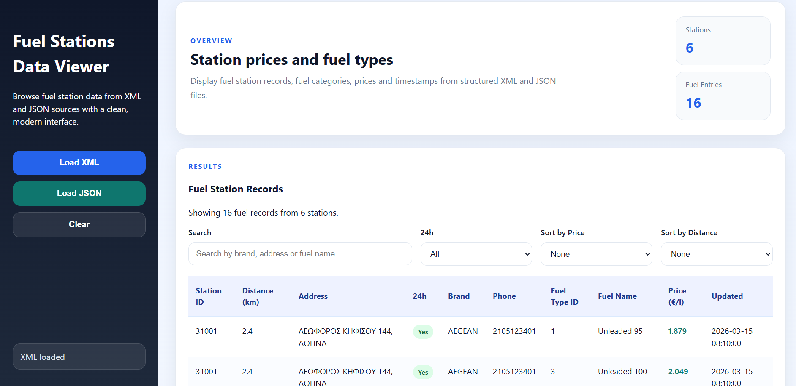

# Fuel Stations Data Viewer

A responsive web application that loads, parses and visualizes fuel station data from **XML and JSON** sources.  
The interface allows users to explore fuel station records using **search, filtering and sorting**.

## Preview

## Features

- Load and parse fuel station datasets from **XML** and **JSON**
- Dynamic **data table rendering**
- **Search** by brand, address or fuel type
- **Filter** stations by 24h availability
- **Sort** results by fuel price or station distance
- Responsive layout

## Technologies

- HTML5
- CSS3
- JavaScript (ES6)
- Fetch API
- XML
- JSON
